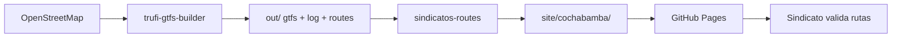

# sindicatos-routes

Generador de reportes interactivos por sindicato (HTML + Markdown) para validación de rutas con mapas Leaflet/OSM. Pensado para publicar en **GitHub Pages** con una URL aislada por sindicato.

## Estructura del proyecto

```
sindicatos-routes/
├── config/              # Configuración por ciudad
│   └── cochabamba.json
├── src/
│   ├── generate.ts      # CLI principal
│   ├── load_gtfs_out.ts # Lee salida de trufi-gtfs-builder
│   ├── gtfs_types.ts
│   └── reports/         # Generadores HTML, MD, datos
└── site/                # Salida publicable (GitHub Pages)
    └── cochabamba/
        ├── _internal/manifest.json   ← solo Trufi (lista de URLs)
        └── {slug-sindicato}/
            ├── index.html          ← validación interactiva
            ├── report.md
            └── data.json
```

## Qué necesitas para generar los informes

### 1. Salida de `trufi-gtfs-builder` (obligatorio)

Primero genera el GTFS con **estas opciones activas** en `outputFiles`:

| Opción | Archivo | Para qué |
|--------|---------|----------|
| `gtfs: true` | `out/gtfs/*.txt` | Rutas, viajes, paradas, agencies (sindicatos) |
| `log: true` | `out/log.json` | Tags OSM: `operator`, `ref`, `from`, `to`, errores |
| `routes: true` | `out/routes/{id}.geojson` | Geometría para mapas |

Ejemplo (Cochabamba):

```bash
cd trufi-gtfs-builder
npm run build
cd examples/Bolivia-Cochabamba
npx ts-node index.ts
```

### 2. Tag OSM `operator` en cada relación

El sindicato se toma del tag **`operator`** en OpenStreetMap. Debe coincidir con el nombre del sindicato en OSM para agrupar correctamente.

### 3. Node.js

- Node 18+ recomendado
- `npm install` en esta carpeta

### 4. Configuración de ciudad

Archivo `config/{ciudad}.json`:

```json
{
  "cityName": "cochabamba",
  "displayName": "Cochabamba, Bolivia",
  "gtfsOutDir": "../../trufi-gtfs-builder/examples/Bolivia-Cochabamba/out",
  "siteSubdir": "cochabamba",
  "githubPagesBasePath": "/sindicatos-routes/site"
}
```

- **gtfsOutDir**: ruta al folder `out/` del gtfs-builder (relativa al config o absoluta)
- **siteSubdir**: subcarpeta en `site/` donde se escriben los reportes
- **githubPagesBasePath**: prefijo URL en GitHub Pages (ajustar según tu repo)

## Generar reportes

```bash
cd sindicatos-routes
npm install
npm run generate:cochabamba
# o: npm run generate -- trujillo   (cuando exista config/trujillo.json)
```

Salida en `site/cochabamba/` — **43 carpetas** (una por sindicato) en Cochabamba.

## URLs para compartir con sindicatos

Cada sindicato tiene URL **aislada** (sin links a otros sindicatos):

```
https://TU-USUARIO.github.io/TU-REPO/sindicatos-routes/site/cochabamba/sindicato-mixto-de-autotransporte-sacaba/
```

Lista interna de slugs: `site/cochabamba/_internal/manifest.json`

Markdown (GitHub lo renderiza):

```
…/site/cochabamba/sindicato-mixto-de-autotransporte-sacaba/report.md
```

## Publicar en GitHub Pages

**Opción A — carpeta `/site` en el repo**

1. Repo → Settings → Pages
2. Source: branch `main`, folder `/` (root) o publica solo `sindicatos-routes/site` vía workflow

**Opción B — GitHub Actions** (recomendado)

Workflow que:
1. Ejecuta `trufi-gtfs-builder` (o usa `out/` cacheado)
2. Ejecuta `npm run generate:cochabamba`
3. Despliega `sindicatos-routes/site/` a gh-pages

**Opción C — subcarpeta del monorepo**

Si el repo es `Trufi-MAIN`, la URL base incluye el path:
`/sindicatos-routes/site/cochabamba/{slug}/`

## Flujo completo



## Contenido de cada informe

**HTML (`index.html`)**
- Mapa con todas las rutas del sindicato
- Mapa por línea (ref) al expandir
- Filtro y búsqueda
- Validación: Correcta / Corregir / No es nuestra + observaciones
- Exportar JSON de validación
- Links a OpenStreetMap por relación

**Markdown (`report.md`)**
- Tablas por ref y variante OSM
- Links OSM
- Checklist de validación

## Agregar otra ciudad

1. Genera `out/` con trufi-gtfs-builder para esa ciudad
2. Crea `config/mi-ciudad.json` apuntando al `out/`
3. `npm run generate -- mi-ciudad`

## Dependencias entre proyectos

| Proyecto | Rol |
|----------|-----|
| `trufi-gtfs-builder` | OSM → GTFS + archivos auxiliares (`log`, `routes`) |
| `sindicatos-routes` | GTFS out → reportes HTML/MD por sindicato |

No hay dependencia npm entre ellos: `sindicatos-routes` solo **lee archivos** del folder `out/`.
